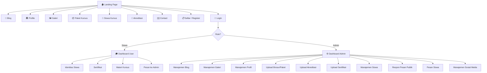
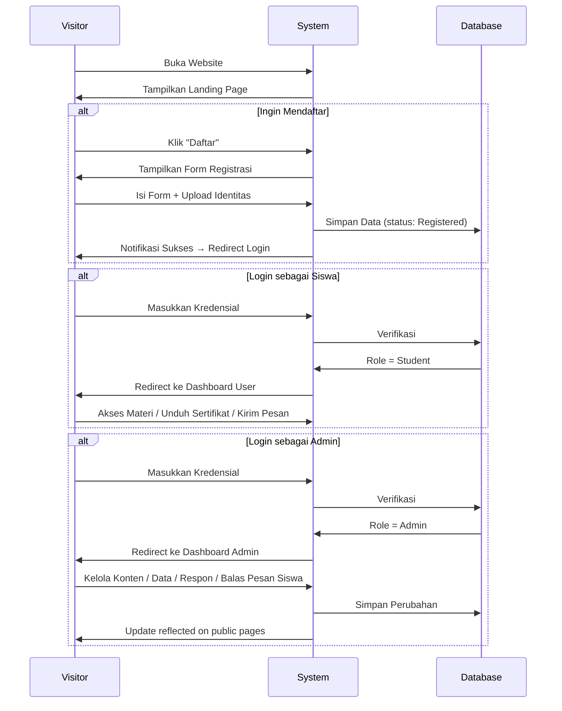

# Frontend Plan — LKP Parduli Rasa Komputer

## 1. Ringkasan Proyek

Website pendidikan untuk **Lembaga Kursus & Pelatihan (LKP) Parduli Rasa Komputer** yang berfungsi sebagai portal informasi publik, sistem pendaftaran siswa baru, dan sistem manajemen pembelajaran dasar (unduh materi & sertifikat).

## User Review Required
> [!IMPORTANT]
> Sistem saat ini belum menggunakan Tailwind CSS (masih menggunakan rencana Vanilla CSS). Rencana ini telah direvisi untuk mengganti ke **Tailwind CSS**. 
> Mohon konfirmasi apakah Anda setuju dengan rencana instalasi dan konfigurasi Tailwind CSS ini, sehingga saya bisa langsung mengeksekusinya.

## Proposed Changes

### Konfigurasi Tailwind CSS
- Menginstal dependensi `tailwindcss`, `@tailwindcss/vite` atau `postcss` + `autoprefixer` (sesuai standar Vite terbaru).
- Menyiapkan konfigurasi Tailwind (`tailwind.config.js` atau konfigurasi Vite plugin) untuk memasukkan tema warna LKP Parduli Rasa.
- Mengubah `src/index.css` untuk menggunakan direktif Tailwind (`@tailwind base; @tailwind components; @tailwind utilities;` atau ekuivalen v4).
- Memastikan instalasi terhubung dengan baik agar kelas Tailwind CSS siap digunakan di seluruh komponen React.

---

## 2. Tech Stack

| Layer | Teknologi | Alasan |
|---|---|---|
| Framework | **Vite + React** | Cepat, modern, ekosistem besar |
| Styling | **Tailwind CSS** | Utility-first, mempercepat styling, konsisten, responsif |
| Routing | **React Router v6** | Standar de-facto untuk SPA React |
| Icons | **Lucide React** | Ringan, konsisten, open-source |
| Fonts | **Google Fonts** — Inter (body), Outfit (heading) | Modern, premium, mudah dibaca |
| PDF Generation | **jsPDF** / **html2pdf.js** | Untuk fitur unduh data siswa & sertifikat |
| HTTP Client | **Fetch API** (native) | Ringan, cukup untuk kebutuhan saat ini |

---

## 3. Sitemap & Navigasi

### 3.1 Struktur Halaman



### 3.2 Navigasi Publik (Navbar)

```
┌──────────────────────────────────────────────────────────────────────┐
│  🎓 LKP Parduli Rasa   │ Blog │ Profile │ Galeri │ Paket │ Siswa │  │
│                         │      │         │        │ Kursus│ Kursus│  │
│                         │ Akreditasi │ Contact │     [Login] [Daftar]│
│                         │            │         │    🔵 FB  📷 IG    │
└──────────────────────────────────────────────────────────────────────┘
```

- **Desktop**: Horizontal navbar fixed di atas, semua menu terlihat
- **Mobile (< 768px)**: Hamburger menu, menu geser dari kiri (*slide-in drawer*)
- **Login/Register**: Tombol di pojok kanan atas
- **Sosial Media**: Ikon Facebook & Instagram di samping tombol Login

### 3.3 Navigasi Dashboard (Sidebar)

**Student Dashboard:**
```
┌─────────────────┬──────────────────────────────────┐
│ 🎓 Dashboard    │  [Content Area]                  │
│─────────────────│                                  │
│ 👤 Identitas    │                                  │
│ 📜 Sertifikat   │                                  │
│ 📚 Materi       │                                  │
│ 💬 Pesan        │                                  │
│                 │                                  │
│ 🚪 Logout       │                                  │
└─────────────────┴──────────────────────────────────┘
```

**Admin Dashboard:**
```
┌─────────────────┬──────────────────────────────────┐
│ ⚙️ Admin Panel  │  [Content Area]                  │
│─────────────────│                                  │
│ 📝 Blog         │                                  │
│ 🖼 Galeri       │                                  │
│ 🏛 Profil       │                                  │
│ 📦 Paket Kursus │                                  │
│ 🏅 Akreditasi   │                                  │
│ 📜 Sertifikat   │                                  │
│ 👥 Data Siswa   │                                  │
│ ✉️ Respon Publik│                                  │
│ 💬 Pesan Siswa  │                                  │
│ 🔗 Sosial Media │                                  │
│                 │                                  │
│ 🚪 Logout       │                                  │
└─────────────────┴──────────────────────────────────┘
```

- **Desktop (> 1024px)**: Sidebar tetap terbuka, 250px lebar
- **Tablet (768–1024px)**: Sidebar collapsed ke ikon saja, expand on hover
- **Mobile (< 768px)**: Sidebar tersembunyi, toggle via hamburger di header

---

## 4. Design System & UI/UX

### 4.1 Color Palette (berdasarkan Logo LKP Parduli Rasa)

| Token | Hex | Penggunaan |
|---|---|---|
| `--primary` | `#4CAF50` | Tombol utama, link navbar, accent (hijau muda dari logo) |
| `--primary-light` | `#81C784` | Hover state, badge |
| `--primary-dark` | `#388E3C` | Active state, heading |
| `--secondary` | `#FF7043` | CTA sekunder, highlight (orange dari logo) |
| `--secondary-light` | `#FF8A65` | Hover secondary |
| `--mint` | `#80CBC4` | Ikon dekoratif, ilustrasi (mint/cyan dari logo buku) |
| `--accent` | `#FFC107` | Badge, notifikasi, rating |
| `--success` | `#66BB6A` | Status sukses, enrolled |
| `--danger` | `#EF5350` | Error, hapus, peringatan |
| `--bg-main` | `#F1F8E9` | Background utama (nuansa hijau sangat muda) |
| `--bg-card` | `#FFFFFF` | Card, form, modal |
| `--bg-dark` | `#1B5E20` | Navbar, footer, sidebar (hijau tua) |
| `--text-primary` | `#212121` | Teks utama |
| `--text-secondary` | `#616161` | Teks sekunder, placeholder |
| `--text-on-dark` | `#FFFFFF` | Teks di atas background gelap |
| `--border` | `#C8E6C9` | Border, divider (nuansa hijau) |

> **Tema**: Segar, profesional, edukatif — kombinasi hijau muda (logo, pertumbuhan, kepercayaan) dengan aksen orange (energi, semangat) dan mint/cyan (kreativitas, teknologi). Sesuai dengan identitas visual logo LKP Parduli Rasa.

### 4.2 Typography

```css
/* Heading */
font-family: 'Outfit', sans-serif;
/* H1 */ font-size: 2.5rem; font-weight: 700;
/* H2 */ font-size: 2rem;   font-weight: 600;
/* H3 */ font-size: 1.5rem; font-weight: 600;

/* Body */
font-family: 'Inter', sans-serif;
/* Body */ font-size: 1rem;    font-weight: 400; line-height: 1.7;
/* Small */ font-size: 0.875rem; font-weight: 400;
```

### 4.3 Spacing & Layout

- Grid System: CSS Grid + Flexbox
- Max content width: `1280px`, centered
- Spacing scale: `4px, 8px, 12px, 16px, 24px, 32px, 48px, 64px`
- Border radius: `8px` (cards), `12px` (modals), `999px` (pills/badges)

### 4.4 Component Library (yang akan dibuat)

| Komponen | Deskripsi |
|---|---|
| `Navbar` | Fixed top navbar, responsive hamburger |
| `Footer` | Info kontak, link cepat, sosmed |
| `HeroSection` | Banner besar dengan CTA di landing page |
| `CourseCard` | Kartu program kursus dengan ikon & harga |
| `BlogCard` | Kartu artikel blog (thumbnail, judul, tanggal) |
| `GalleryGrid` | Grid responsif foto/video (masonry-style) |
| `DataTable` | Tabel data siswa dengan fitur unduh PDF |
| `ContactForm` | Formulir kontak (Nama, Alamat, Email, Deskripsi) |
| `RegisterForm` | Form pendaftaran siswa lengkap + upload file |
| `LoginForm` | Form login (username/password) |
| `Sidebar` | Sidebar navigasi untuk dashboard |
| `MessageChat` | Komponen chat/pesan antara siswa dan admin |
| `DashboardHeader` | Header dashboard (nama user, avatar, logout) |
| `ProfileEditor` | Form edit identitas siswa (CRUD) |
| `CertificateCard` | Kartu sertifikat + tombol unduh |
| `CourseMaterial` | Daftar materi kursus per program |
| `AdminTable` | Tabel CRUD generik untuk admin |
| `Modal` | Dialog modal untuk konfirmasi/form |
| `FileUploader` | Komponen upload file (gambar, PDF, identitas) |
| `Badge` | Status badge (Registered, Enrolled, Graduated) |
| `Button` | Tombol utama, sekunder, danger, outline |
| `Alert` | Notifikasi sukses, error, warning |
| `Breadcrumb` | Navigasi breadcrumb di dashboard |
| `Pagination` | Navigasi halaman tabel |
| `SearchBar` | Input pencarian dengan ikon |

### 4.5 Micro-Animations & Interaksi

| Element | Animasi |
|---|---|
| Navbar | Scroll → shrink + shadow |
| Cards | Hover → `translateY(-4px)` + shadow |
| Buttons | Hover → gradient shift, click → scale 0.97 |
| Page transition | Fade-in `opacity 0→1` (300ms) |
| Modal | Backdrop fade + content slide-up |
| Gallery images | Hover → slight zoom (1.05) + overlay |
| Sidebar menu | Active item → slide-in indicator bar |
| Form submit | Loading spinner → success checkmark |
| Scroll reveal | Elemen muncul dari bawah saat di-scroll |

---

## 5. Halaman Detail & Wireframe Deskripsi

### 5.1 Landing Page (`/`)

```
┌──────────────────── NAVBAR ────────────────────────┐
├────────────────────────────────────────────────────┤
│            🎓 HERO SECTION                         │
│   "Tingkatkan Skill Komputer Anda Bersama          │
│    LKP Parduli Rasa Komputer"                      │
│   [Daftar Sekarang]  [Lihat Program]               │
│   Background: gradient hijau + ilustrasi komputer   │
├────────────────────────────────────────────────────┤
│  ✅ KEUNGGULAN (3 kolom cards)                     │
│  [Pengajar Berpengalaman] [Sertifikat Resmi]       │
│  [Harga Terjangkau]                                │
├────────────────────────────────────────────────────┤
│  📦 PROGRAM KURSUS UNGGULAN (grid 3 kolom)         │
│  [Word] [Excel] [PowerPoint]                       │
│  [Photoshop] [CorelDraw] [AutoCAD]                 │
├────────────────────────────────────────────────────┤
│  📝 BLOG TERBARU (3 artikel terbaru)               │
├────────────────────────────────────────────────────┤
│  📊 STATISTIK (counter animasi)                    │
│  [500+ Alumni] [6 Program] [10+ Tahun]             │
├────────────────────────────────────────────────────┤
│              FOOTER                                │
└────────────────────────────────────────────────────┘
```

### 5.2 Blog (`/blog`)
- Grid 2–3 kolom `BlogCard` (gambar, judul, ringkasan, tanggal)
- Halaman detail (`/blog/:id`) → full article layout
- Pagination bawah

### 5.3 Profile (`/profile`)
- Sejarah singkat LKP + Visi Misi
- Foto gedung/kegiatan
- Struktur organisasi (opsional)

### 5.4 Galeri (`/galeri`)
- Filter tab: **Semua / Foto / Video**
- Grid masonry responsive
- Klik foto → Lightbox overlay full-screen
- Klik video → video player modal

### 5.5 Paket Kursus (`/paket-kursus`)
- 6 kartu program (satu per kursus)
- Setiap kartu: ikon program, judul, deskripsi singkat, harga, tombol **Lihat Brosur** (unduh PDF)
- Hover effect pada kartu

### 5.6 Siswa Kursus (`/siswa-kursus`)
- `DataTable` dengan kolom: No, NIS, Nama, Program, Status
- Tombol **Unduh PDF** untuk download seluruh daftar
- Search bar + filter by program
- Pagination

### 5.7 Akreditasi (`/akreditasi`)
- Tampilan dokumen akreditasi (gambar/PDF viewer)
- Card grid jika lebih dari 1 dokumen
- Tombol unduh PDF

### 5.8 Contact (`/contact`)
- Formulir: Nama, Alamat, Email, Deskripsi (textarea)
- Peta lokasi (embed Google Maps)
- Info kontak langsung (telepon, email, alamat)
- Validasi form + notifikasi sukses

### 5.9 Register (`/daftar`)
- Form multi-step atau single-page:
  - **Step 1**: Nama Lengkap, Email, Password
  - **Step 2**: Alamat, No HP
  - **Step 3**: Upload Identitas (KTP/KK/SIM) — *drag & drop area*
  - **Step 4**: Pilih Program Kursus
- Validasi setiap field
- Notifikasi sukses + redirect ke login

### 5.10 Login (`/login`)
- Form: Username/Email, Password
- Link ke halaman Register
- Error feedback jika gagal login
- Redirect ke dashboard sesuai role setelah sukses

---

## 6. Routing Map

```
/                         → Landing Page
/blog                     → Daftar Artikel
/blog/:id                 → Detail Artikel
/profile                  → Profil Lembaga
/galeri                   → Galeri Foto & Video
/paket-kursus             → Daftar Paket Kursus
/siswa-kursus             → Database Siswa (publik)
/akreditasi               → Dokumen Akreditasi
/contact                  → Formulir Kontak
/daftar                   → Registrasi Calon Siswa
/login                    → Halaman Login

/dashboard/               → Dashboard User (Protected, Role: Student)
  /dashboard/identitas    → Edit Profil Siswa
  /dashboard/sertifikat   → Unduh Sertifikat
  /dashboard/materi       → Lihat Materi Kursus
  /dashboard/pesan        → Kirim & Baca Pesan ke Admin

/admin/                   → Dashboard Admin (Protected, Role: Admin)
  /admin/blog             → CRUD Blog
  /admin/galeri           → CRUD Galeri
  /admin/profil           → Edit Profil Lembaga
  /admin/paket-kursus     → Upload/Edit Brosur
  /admin/akreditasi       → Upload Dokumen Akreditasi
  /admin/sertifikat       → Upload Sertifikat (by NIS)
  /admin/siswa            → CRUD Data Siswa
  /admin/respon           → Kelola Pesan Masuk dari Publik (Contact)
  /admin/pesan-siswa      → Kelola Pesan dari Siswa Terdaftar
  /admin/sosial-media     → Kelola Link Sosial Media
```

---

## 7. Folder Structure

```
LKP Parduli Rasa/
├── index.html
├── package.json
├── vite.config.js
├── public/
│   ├── favicon.ico
│   └── images/            ← aset gambar statis
├── src/
│   ├── main.jsx
│   ├── App.jsx
│   ├── index.css          ← design system (tokens, resets, global)
│   ├── assets/            ← gambar, ikon SVG
│   ├── components/        ← reusable UI components
│   │   ├── Navbar/
│   │   ├── Footer/
│   │   ├── HeroSection/
│   │   ├── CourseCard/
│   │   ├── BlogCard/
│   │   ├── GalleryGrid/
│   │   ├── DataTable/
│   │   ├── ContactForm/
│   │   ├── RegisterForm/
│   │   ├── LoginForm/
│   │   ├── Sidebar/
│   │   ├── DashboardHeader/
│   │   ├── Modal/
│   │   ├── FileUploader/
│   │   ├── Button/
│   │   ├── Badge/
│   │   ├── Alert/
│   │   ├── Breadcrumb/
│   │   ├── Pagination/
│   │   └── SearchBar/
│   ├── pages/
│   │   ├── public/        ← halaman publik
│   │   │   ├── LandingPage.jsx
│   │   │   ├── BlogPage.jsx
│   │   │   ├── BlogDetail.jsx
│   │   │   ├── ProfilePage.jsx
│   │   │   ├── GaleriPage.jsx
│   │   │   ├── PaketKursusPage.jsx
│   │   │   ├── SiswaKursusPage.jsx
│   │   │   ├── AkreditasiPage.jsx
│   │   │   ├── ContactPage.jsx
│   │   │   ├── RegisterPage.jsx
│   │   │   └── LoginPage.jsx
│   │   ├── dashboard/     ← halaman siswa
│   │   │   ├── DashboardHome.jsx
│   │   │   ├── IdentitasPage.jsx
│   │   │   ├── SertifikatPage.jsx
│   │   │   ├── MateriPage.jsx
│   │   │   └── PesanPage.jsx
│   │   └── admin/         ← halaman admin
│   │       ├── AdminDashboard.jsx
│   │       ├── AdminBlog.jsx
│   │       ├── AdminGaleri.jsx
│   │       ├── AdminProfil.jsx
│   │       ├── AdminPaketKursus.jsx
│   │       ├── AdminAkreditasi.jsx
│   │       ├── AdminSertifikat.jsx
│   │       ├── AdminSiswa.jsx
│   │       ├── AdminRespon.jsx
│   │       ├── AdminPesanSiswa.jsx
│   │       └── AdminSosialMedia.jsx
│   ├── layouts/
│   │   ├── PublicLayout.jsx    ← Navbar + Footer wrapper
│   │   ├── DashboardLayout.jsx ← Sidebar + Header wrapper (student)
│   │   └── AdminLayout.jsx     ← Sidebar + Header wrapper (admin)
│   ├── context/
│   │   └── AuthContext.jsx     ← auth state management
│   ├── hooks/
│   │   └── useAuth.js
│   ├── utils/
│   │   ├── api.js              ← fetch wrapper (future backend)
│   │   └── helpers.js
│   └── data/
│       └── mockData.js         ← data dummy untuk Development
```

---

## 8. Responsive Breakpoints

| Breakpoint | Lebar | Layout |
|---|---|---|
| Mobile | `< 768px` | 1 kolom, hamburger menu, stacked cards |
| Tablet | `768px – 1024px` | 2 kolom grid, collapsed sidebar |
| Desktop | `> 1024px` | 3 kolom grid, full sidebar, max-width 1280px |

---

## 9. UX Flow Summary



---

## 10. Verification Plan

### Browser Testing
Setelah implementasi, verifikasi dilakukan menggunakan browser subagent:
1. **Navigasi publik** — buka setiap halaman publik, pastikan render tanpa error
2. **Responsif** — resize browser ke 375px (mobile), 768px (tablet), 1280px (desktop)
3. **Form validation** — test form kontak & registrasi dengan data valid & invalid
4. **Login flow** — test login dengan mock data admin & siswa, verifikasi redirect
5. **Dashboard** — pastikan sidebar, header, dan content area render dengan benar
6. **Interaksi** — hover effect pada card, animasi scroll, hamburger menu mobile

### Manual Testing oleh User
- User diminta membuka `npm run dev` dan memeriksa tampilan pada browser lokal
- User diminta memeriksa apakah alur navigasi sesuai ekspektasi
- User diminta memberikan feedback tentang estetika dan warna

---

## Catatan

> [!NOTE]
> **Backend**: Plan ini hanya mencakup **frontend** dengan mock data. Integrasi backend akan direncanakan di tahap selanjutnya.

> [!NOTE]
> **Fitur Pesan**: Terdapat dua sistem pesan yang terpisah:
> 1. **Menu Contact** (publik) → untuk masyarakat umum mengirim pertanyaan → Admin merespon di **Admin Respon**
> 2. **Menu Pesan** (dashboard siswa) → untuk siswa terdaftar mengirim pesan ke Admin → Admin merespon di **Admin Pesan Siswa**
